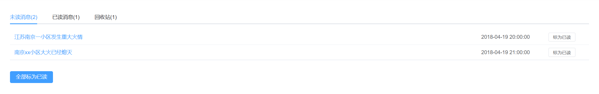

# FireRescue
A platform for managing auxiliary rescue devices for fire rescue

## 功能说明
按ui界面版块进行介绍
### 系统首页
1. 管理员信息：登录时间，管理员名字
2. 系统情况概览：用户访问量，系统消息，火灾发生数量
3. 待办事项
4. 火情信息统计：火灾成因，火灾造成的经济损失
### 设备及人员管理情况
#### 设备情况

展示传感器采集的信息
#### 人员情况

展示所管理人员的基本情况
### 消息中心

展示管理人员下发的通知
### 火情相关数据统计
1. 火灾造成的经济损失
2. 火灾发生的风险
3. 火灾类型统计
4. 设备数据
  - 温度
  - 湿度
  - 有害气体浓度
  - 火情
### 生命体征检测
1. 信号强度
2. 心率
3. 呼吸频率
4. 动态探测
### 设备控制
1. 终端数据查询
2. 无人机状态控制
### 逃生路线展示
该部分实时更新最佳逃生路线

## 组件介绍
### views
以下以代码为板块进行介绍，组件放在views文件夹中 "ManageSystemVue/vue-manage-system/src/views"
#### 403.vue
用户没有权限访问时自动展示403页面（系统实现了人员分级管理，不同等级的用户可访问的功能不同）
#### 404.vue
网络连接错误时展示，用户请求的页面不存在时展示该界面
#### charts.vue
用于集中展示"火情相关数据统计"界面的四个图表，调用了charts文件夹中的:
- areaCharts.vue
- riskCharts.vue
- typeCharts.vue
- deviceCharts.vue
#### control.vue
用于设备管理页面中的表格展示 ，调用从数据库获取的数据
#### dashboard.vue
用于首页中的管理员信息板块展示，上次登录的时间从数据库中获取，后被更新为当前时间
#### editor.vue
用于人员管理页面的人员信息修改模块 支持新增，修改，删除信息
#### home.vue
用于初始化ui界面的整体框架，以上组件均被放置在该组件中
#### JingYin.vue WanDaMao.vue 
展示设备管理界面
#### login.vue
用于显示登录界面
#### map.vue
后期扩展地图功能的接口
#### monitor.vue 
将从数据库获取的生命体征相关数据实时更新在图表中，用于在生命体征检测界面的展示
#### permission.vue
管理侧边栏,支持分级结构
#### table.vue
用于人员管理界面的表格信息展示
#### tabs.vue
用于缓存页面，允许用户在页面上端点击标签页打开最近访问的界面
#### users.vue
展示用户管理界面中对人员信息进行管理时显示的界面

### components
ui整体框架界面
#### header.vue
顶部状态栏
#### siderbar.vue
侧边栏
#### table-detail.vue
表格信息展示
#### table-edit.cue
表格信息编辑
#### tags.vue
标签页管理
## 项目构架介绍
### 前端
采用vue3作为主要框架，利用view-lite进行组件管理，利用echarts进行开发，与springboot进行交互以获取动态数据
### 后端
利用springboot为主要框架，面向接口进行开发，利用mybatis与数据库进行交互
### 数据库
使用mysql作为存储介质，数据存储在阿里云服务器中
### 硬件交互
利用阿里云iot平台将各硬件返回的数据进行汇总，利用mqtt协议与后端进行通信
